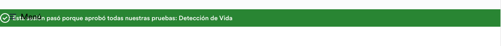

Here’s your README in one clean, easy-to-copy block:

```markdown
# Incode Test Automation Project

## 🛠️ Prerequisites
- **Homebrew** (macOS package manager)  
  ```bash
  /bin/bash -c "$(curl -fsSL https://raw.githubusercontent.com/Homebrew/install/HEAD/install.sh)"
  ```
- **Java Development Kit (JDK) 17**
  ```bash
  brew install openjdk@17
  brew link --force --overwrite openjdk@17
  ```
- **Apache Maven**
  ```bash
  brew install maven
  ```

Verify installation:
```bash
java -version
mvn -version
```

---

## 📦 Installation
1. Clone the repository:
   ```bash
   git clone <repo-url>
   cd <repo-folder>
   ```
2. Build and install dependencies:
   ```bash
   mvn clean install
   ```

---

## ▶️ Execution
Run all tests:
```bash
mvn test
```

Report location:
```
target/cucumber-reports/cucumber-report.html
```

Open report:
```bash
open target/cucumber-reports/cucumber-report.html
```

---

## 📂 Project Structure
- `src/test/resources/features` → Gherkin `.feature` files
- `src/test/java/stepdefinitions` → Step definitions
- `src/test/java/pages` → Page Object Model classes
- `target/cucumber-reports` → Reports

---

## 📌 Notes
- Scenarios written in plain English (`.feature` files)
- `mvn test` triggers full execution flow
- Reports generated automatically at `target/cucumber-reports/cucumber-report.html`

---

## 🚨 Issues

### Colliding Names
**Problem:** New flows default to the same name.

**Steps to Reproduce:**
1. Go to [demo-dashboard](https://demo-dashboard.incode.com/log-in)
2. Sign in with:
    - Username: `ilija.andic+1@incode.com`
    - Password: `]kU3*i6|m(=ZdVE`
3. Open hamburger menu (ellipsis, upper left)
4. Select **Flows**
5. Click **New** → verify module addition screen
6. Select **Facial Authentication**
7. Click **Save**

**Expected Behavior:**
- Flow saved successfully
- Flow assigned a **unique default name** (e.g., auto-incremented naming)

### Overlapping Text on Sessions (Facial Recognition Flow)
**Problem:** Text overlaps in session details view.

**Steps to Reproduce:**
1. Go to [demo-dashboard](https://demo-dashboard.incode.com/log-in)
2. Sign in with:
    - Username: `ilija.andic+1@incode.com`
    - Password: `]kU3*i6|m(=ZdVE`
3. Open hamburger menu (ellipsis, upper left)
4. Select **Sessions**
5. Access session with ID: `69b03c26eb15bb76349c83f4`

**Expected Behavior:**
- Text displayed clearly without overlap

**Actual Behavior:**
- Text overlaps in the session view  

